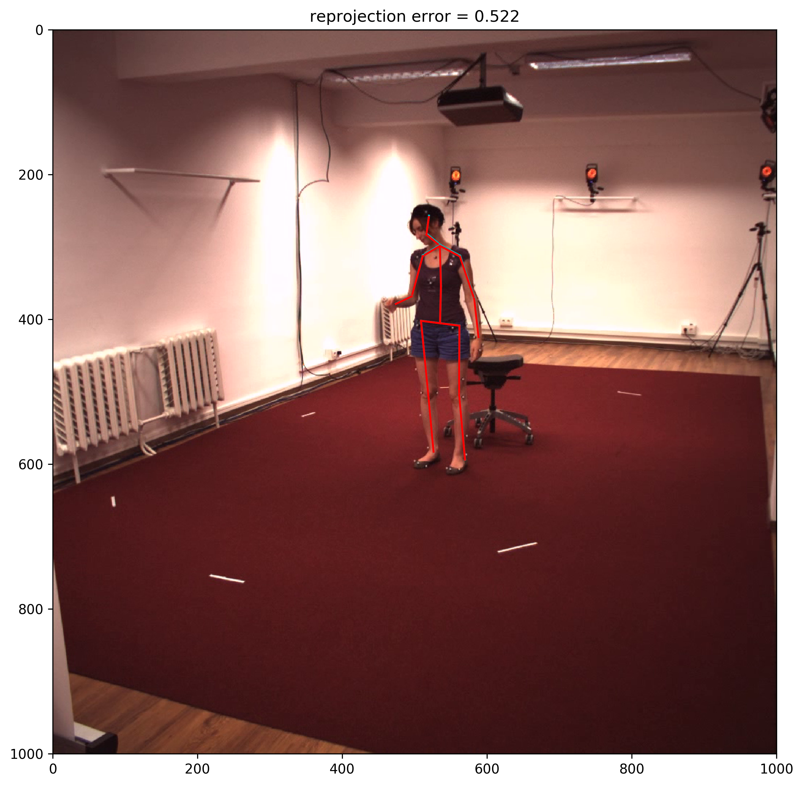

# human36m
## Human3.6M dataset
The dataset can be found in the website below (About dataset), where you can register and download the original dataset. 
For our work you would need the ground truth 2D data, camera parameter, 3D skeletal data, and the video files of each subject and action. 
From the Human3.6m website, the "Poses -> D3 Positions" data and the videos were downloaded, then from VideoPose3D by Facebook Research (https://github.com/facebookresearch/VideoPose3D/blob/main/DATASETS.md), the original dataset was converted to produce 'data_3d_h36m.npz' and 'data_2d_h36m_gt.npz'. 

### About dataset
- Human3.6m -> http://vision.imar.ro/human3.6m/description.php
- Camera parameter -> https://github.com/karfly/human36m-camera-parameters

### Dataset Visualization
##### 3D skeleton data

##### Projected 2D and ground truth 2D skeleton data

##### Reprojection Error graph

##### Data formation of the txt file
The shape of the data is (N, 70), where N is the number of frames and the projection and ground truth  2D skeleton data contains x, y values for the 17 joints.
The structure of the data is as follows:
[frame_no, $x_{proj},\ y_{proj}$, ... , $x_{gt},\ y_{gt}$, ..., reprojection_error]
